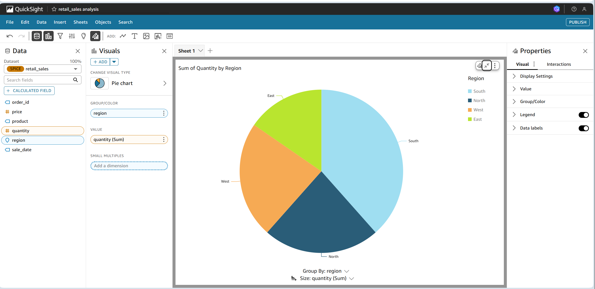

# 🛍️ Retail CSV Data Pipeline Project

A serverless AWS data pipeline that transforms uploaded retail CSVs into clean, queryable data and visualizes it with QuickSight.

---

## 🧰 Tools & AWS Services Used

- **Amazon S3** – Store raw and processed retail data
- **AWS Lambda** – Triggered ETL function (CSV → Parquet)
- **Amazon Athena** – Query Parquet data using SQL
- **Amazon QuickSight** – Create dashboards and insights
- **AWS CloudFormation** – Define infrastructure as code (IaC)
- **GitHub Actions** – CI/CD for automated deployment

---

## 📁 Project Structure

```bash
retail-csv-pipeline/
│
├── .github/workflows/
│   └── deploy.yaml             # CI/CD Pipeline with GitHub Actions
│
├── cloudformation/
│   └── template.yaml           # Creates S3, Lambda, IAM Roles, Athena
│
├── lambda/
│   └── transform_csv.py        # Python ETL logic (CSV → Parquet)
│
├── scripts/
│   └── sample_data.csv         # Example retail sales data
│
├── quicksight/
│   └── dashboard.png           # QuickSight dashboard screenshot
└── README.md                   # Project documentation


## 🔁 Data Flow (Step-by-Step)

1. **CSV Upload** → Raw CSV is uploaded to S3 `input` folder  
2. **Lambda Trigger** → CSV is automatically transformed to Parquet  
3. **Processed Data** → Stored in a `/processed/` folder in S3  
4. **Athena Querying** → Data becomes available for SQL queries  
5. **QuickSight Dashboard** → Visualized into interactive charts  

---

## 📈 Sample Data (CSV)

File: `scripts/sample_data.csv`

```csv
order_id,region,product,quantity,price,sale_date
001,North,Laptop,2,1500.00,2025-07-01
002,South,Phone,5,800.00,2025-07-01
003,West,Tablet,3,600.00,2025-07-02
004,North,Phone,1,800.00,2025-07-03
005,East,Laptop,2,1500.00,2025-07-03
```

---

## 📊 Dashboard Preview

Example Amazon QuickSight dashboard visualization:



---

## 🚀 How to Deploy

### Step 1 – Deploy Infrastructure

Push code to GitHub to trigger GitHub Actions:

```yaml
# .github/workflows/deploy.yaml

aws cloudformation deploy \
  --template-file cloudformation/template.yaml \
  --stack-name RetailPipelineStack \
  --capabilities CAPABILITY_NAMED_IAM
```

This will set up:

- ✅ S3 Buckets  
- ✅ Lambda Function  
- ✅ IAM Roles  
- ✅ Athena Tables

---

### Step 2 – Upload Sample CSV

Upload `sample_data.csv` into your S3 input bucket, for example:

```bash
s3://retail-data-bucket-ha123/input/sample_data.csv
```

---

### Step 3 – Query Data in Athena

Once the Lambda processes the file, query the transformed data with:

```sql
SELECT * FROM retail_sales;
```

---

### Step 4 – Visualize in QuickSight

1. Go to **Amazon QuickSight**  
2. Create **New Dataset** → Choose **Athena**  
3. Select `retail_sales` table  
4. Build your chart (e.g., Pie Chart by `product`)

---

## 🙋 About

- **Built by**: Hauwa Njidda  
- **📧 Email**: hauwa.njidda@example.com  
- **🌐 GitHub**: [github.com/hauwa-njidda](https://github.com/hauwa-njidda)
